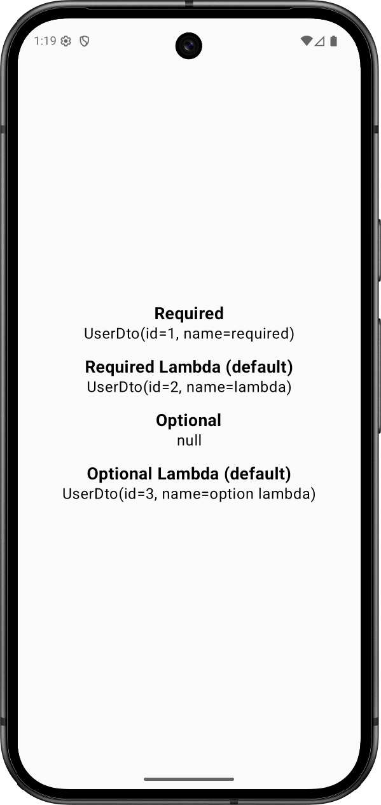

# View

**savedInject** : [ReadWriteProperty](https://kotlinlang.org/api/core/kotlin-stdlib/kotlin.properties/-read-write-property/) + [SavedStateRegistry.SavedStateProvider](https://developer.android.com/reference/androidx/savedstate/SavedStateRegistry.SavedStateProvider)

- 참고 : [SavedStateRegistryOwnerDelegate](https://github.com/androidx/androidx/blob/androidx-main/savedstate/savedstate/src/commonMain/kotlin/androidx/savedstate/serialization/SavedStateRegistryOwnerDelegate.kt)

## DTO

```kotlin
data class UserDto(
    val id: Int,
    val name: String
) : Serializable
```

## Sample value

```kotlin
class SampleActivity : ComponentActivity() {
   // non-null
   private val requiredUser by savedInjectNonNull<UserDto>()
   private val requiredUserLambda by savedInjectNonNull<UserDto> {
      UserDto(id = 2, name = "lambda")
   }

   // nullable
   private val optionUser by savedInject<UserDto>()
   private val optionUserLambda by savedInject<UserDto> {
      UserDto(id = 3, name = "option lambda")
   }
}
```

|                    Default                     |
| :--------------------------------------------: |
|  |

## Sample variable

```kotlin
class SampleActivity : ComponentActivity() {
   // non-null
   private var requiredUser by savedInjectNonNull<UserDto>()
   private var requiredUserLambda by savedInjectNonNull<UserDto> {
      UserDto(id = 2, name = "lambda")
   }

   // nullable
   private var optionUser by savedInject<UserDto>()
   private var optionUserLambda by savedInject<UserDto> {
      UserDto(id = 3, name = "option lambda")
   }
}
```


|                 Default                  |                 Recreate                  |
| :--------------------------------------: | :---------------------------------------: |
|  |  |

